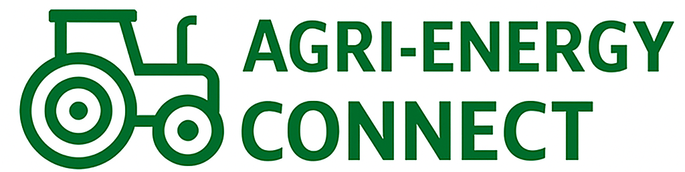

<a id="readme-top"></a>

<!-- BADGES -->
[](#)
[](#)
[](#)

<br />
<p align="center">
  
  <h1 align="center">Agri-Energy Connect Platform</h1>
  <p align="center">
    Bridging Farmers & Green Energy Innovation 🌱⚡<br>
    <strong>PROG7311 - Enterprise Application Development</strong><br>
    <strong>Student: Alyssia Sookdeo | ST10266994</strong>
  </p>
</p>

---

## 📚 Table of Contents

- [📋 Project Overview](#-project-overview)
- [🌱 Features](#-features)
- [🔧 Architecture Overview](#-architecture-overview)
- [💻 Development Setup](#-development-setup)
  - [🧰 Prerequisites](#-prerequisites)
  - [⚙️ Installation & Build Steps](#️-installation--build-steps)
  - [🔗 Configure Connection String](#-configure-connection-string)
- [🚀 Running the Application](#-running-the-application)
- [🔐 User Roles & Authentication](#-user-roles--authentication)
- [🗃️ Database Schema](#️-database-schema)
- [🧪 Testing Guide](#-testing-guide)
- [⚠️ Known Issues](#️-known-issues)
- [🔮 Future Enhancements](#-future-enhancements)
- [👩‍💻 Author](#-author)

---

## 📋 Project Overview

**Agri-Energy Connect** is a web-based prototype that creates a collaborative space for farmers and renewable energy providers. The platform allows:

- 🌾 Farmers to log and manage products  
- 🧑‍💼 Employees to manage farmer profiles and product inventories  
- 🌍 Seamless interaction between agriculture and sustainability  

---

## 🌱 Features

### 👨‍🌾 Farmers
- Secure login & menu dropdown
- Add products (name, category, production date)
- View their own product listings

### 👩‍💼 Employees
- Secure login & menu dropdown
- Add new farmer profiles
- View and filter all products 
- Filter by date range, farmers, and product type

---

## 🔧 Architecture Overview

- **Frontend:** ASP.NET MVC (Razor Views)  
- **Backend:** C# with Entity Framework Core  
- **Database:** Microsoft SQL Server  
- **Auth:** ASP.NET Core Identity  

---

## 💻 Development Setup

### 🧰 Prerequisites

- ✅ Visual Studio 2022 or newer  
- ✅ .NET 6 SDK  
- ✅ SQL Server Management Studio 18+  
- ✅ Git  

---

### ⚙️ Installation & Build Steps

<details>


1. **Clone the Repository**
   ```bash
   git clone https://github.com/st10266994/PROG7311_POE_PART_TWO.git
   cd AgriEnergyConnect
   ```

2. **Restore NuGet Packages**
   - In Visual Studio: Right-click the solution > `Restore NuGet Packages`

3. **Build the Solution**
   - Use `Ctrl + Shift + B` or go to `Build > Build Solution`

</details>

---

### 🔗 Configure Connection String

1. Locate the `appsettings.json` file  
2. Replace `YOUR_SERVER_NAME` with your SQL Server name:

```json
"ConnectionStrings": {
  "DefaultConnection": "Server=YOUR_SERVER_NAME;Database=AgriEnergyConnectDB;Trusted_Connection=True;MultipleActiveResultSets=true"
}
```

3. In SSMS, run the setup script:  
```
/Database/AgriEnergyConnectDB_Setup.sql
```

---

## 🚀 Running the Application

1. **Set Startup Project**
   - Right-click `AgriEnergyConnect.Web` > Set as Startup Project

2. **Run the App**
   - Press `F5` or click ▶️ Start

3. **Login Credentials**

| Role     | Username                  | Password     |
|----------|---------------------------|--------------|
| Farmer   | `farmer@gmail.com`        | `Password@1` |
| Employee | `alyssiasookdeo@gmail.com`| `Password@1` |

---

## 🔐 User Roles & Authentication

- 🔑 **Authentication**: ASP.NET Core Identity  
- 🔒 **Role-based Access**:  

  | Role     | Permissions |
  |----------|-------------|
  | Farmer   | Add/view personal products |
  | Employee | Add/view all products & farmers |

---

## 🗃️ Database Schema

| Table       | Description                          |
|-------------|--------------------------------------|
| `Users`     | Stores login credentials             |
| `Roles`     | Role definitions (Farmer, Employee)  |
| `UserRoles` | Maps users to their assigned roles   |
| `Farmers`   | Profile info of registered farmers   |
| `Products`  | Product entries by farmers           |

---

## 🧪 Testing Guide

### ✅ Login Tests
- Navigate to `/Login`  
- Enter credentials  
- Redirects to appropriate dashboard

### ✅ Farmer Workflow
- Login → Add Product → View Product List

### ✅ Employee Workflow
- Login → Add Farmer → View/Filter Products

---

## ⚠️ Known Issues

- 🐛 Some UI elements may break on mobile  
- 🐛 DatePicker inconsistencies across browsers  
- 🐢 Filtering may be slow with large datasets  

---

## 🔮 Future Enhancements

- ☀️ API integration for farming/weather insights  
- 📲 Mobile app version  
- 🔔 Real-time notifications  
- 📊 Admin analytics dashboard  

---

## 👩‍💻 Author

<table>
  <tr>
    <td align="center">
      <a href="https://github.com/ST10266994">
        
        <br />
        <sub><b>Alyssia Sookdeo</b></sub>
      </a>
      <br/>
      <a href="mailto:ST10266994@vcconnect.edu.za">ST10266994@vcconnect.edu.za</a>
    </td>
  </tr>
</table>

---
